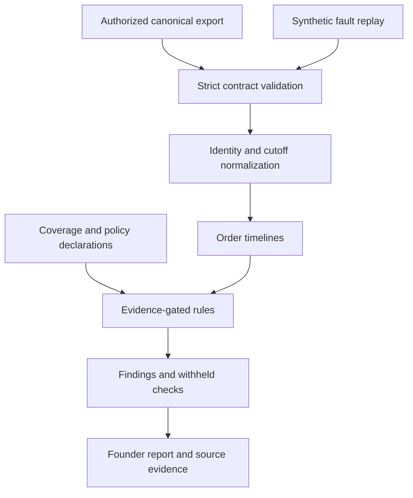

# Architecture and rule semantics

The program is a local batch auditor. It has no network client, browser automation, credential handling or live-write path.

## Evidence layers

- **Order snapshot:** final amount and expectations valid at the audit cutoff. It is not proof of payment.
- **Observation:** a canonical successful transaction, delivery or purchase-signal observation. No inference from ad-platform attributed totals.
- **Coverage declaration:** an adapter/operator assertion that the stream is complete over a stated interval. It is not independently verified by this program.
- **Rule result:** passed, flagged, waiting, not applicable, or not evaluated.
- **Finding:** an observed exception under those assumptions, not a verified cause, legal conclusion or revenue outcome.

An incomplete cash export may still show observed transactions, but the coverage label remains incomplete. The absence of exceptions is not evidence of health.

## Rule catalog

| Rule | Trigger | Important guardrail |
|---|---|---|
| `cash_currency_unresolved` | Cash currency differs from order currency | Withhold cash totals and monetary comparisons; no implicit FX |
| `overcollection` | Gross collection exceeds final order total | Requires complete lifecycle cash coverage; legitimate adjustments need review |
| `refund_exceeds_collection` | Successful refunds exceed successful captures | Prepaid only; incomplete lifecycle cannot establish this exception |
| `delivered_cash_shortfall` | Delivery observed, grace elapsed, gross collection below order total | Refunds are not subtracted when testing initial collection; payment terms require validation |
| `cod_remittance_overdue` | Mature COD collections exceed allocated gross settlements | Subtract all settlements from oldest collections first; uses configured elapsed-hour grace, not business-day calendars |
| `cod_settlement_exceeds_collection` | Allocated settlements exceed COD collections | Investigate allocation, not a reason to reverse bank transfers |
| `signal_policy_conflict` | A signal exists where the supplied per-order policy forbids it | Not a consent-management system or legal assessment |
| `missing_purchase_signal` | Expected signal absent after grace with complete destination export | Not evaluated on missing/stale coverage; not applicable when policy forbids emission |
| `duplicate_purchase_keys` | Multiple normalized purchase identities per order/destination | Potential dedup issue; not proof of downstream double counting |
| `signal_payload_conflict` | Same normalized identity carries differing value/currency | No payload is silently selected as the winner |
| `signal_currency_mismatch` | Signal currency differs from configured order basis | Cross-currency values are never subtracted |
| `signal_value_mismatch` | Same-currency signal differs from destination expectation | Separate expectation allows platform-specific tax/shipping definitions |

## Money and time

All amounts are nonnegative integer minor units on input; computed net values may be negative. The operator supplies verified currency exponents. No floating-point arithmetic or exchange rates are used.

`cod_collected` means cash held by the courier, not the merchant. `cod_settled` is the **gross collection liability discharged** for that order: mapped bank receipt plus specifically recognized deductions. It is not a raw net payout. Unallocated payout batches are not accepted as order-level evidence.

Card captures are not necessarily settled in the merchant's bank. No accounting revenue, profit or bank-balance calculation is implemented.

Dates are normalized to UTC for comparisons. Timeline display orders equal timestamps deterministically by identity; ties do not establish causality. Events after the cutoff are excluded and counted. The final order snapshot must already reflect the cutoff; changing `as_of` alone does not reconstruct historical order edits.

## Identity and deduplication

- Order identity: `(store_id, order_id)`.
- Source record identity: `(store_id, stream, id)`.
- Identical repeated source records are ignored; conflicting repetitions stop the audit.
- Financial `id` must identify a successful transaction, not a webhook delivery. Providers generating multiple notifications for one transaction must be normalized upstream.
- Signal `dedup_key` is a destination-specific identity normalized by the adapter, not a claim that platforms share an API contract or retention window.
- v0.1 checks identities within an order/destination. Cross-order key reuse is not checked; add that control before a production deployment.

## Reproducibility and limits

Every report includes a SHA-256 digest of canonical input JSON, an engine version, supplied policy and coverage, source records, and all rule results. The digest detects differences against a known input; it does not authenticate an upstream source. List reordering changes the input digest but not findings or normalized timelines.

This implementation keeps input and results in memory. The CLI limits input to 20 MiB and validation limits each top-level list to 100,000 records. Those are safety bounds, not performance benchmarks or production capacity guarantees.

## No automated remediation

Recommendations are verification steps only. The program cannot refund customers, collect payments, resend conversion events, change consent, pause ads, or change budgets. An analyst must verify source records and obtain appropriate authority for any later action.
